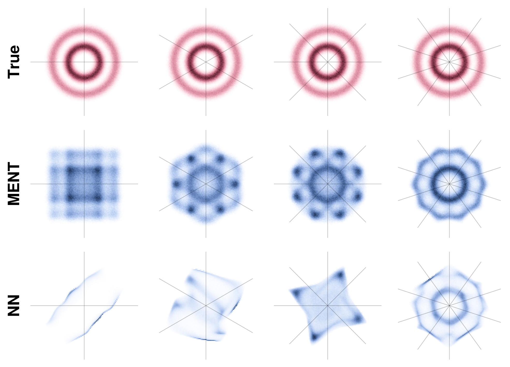

# MENT

This repository implements MENT, an algorithm to reconstruct a distribution from its projections using the method of maximum entropy. The primary application of this algorithm is to phase space tomography in particle accelerators.


## Background

A probability distribution is constrained, but not determined, by a finite set of its projections. Given a set of projections, MENT finds the unique distribution $p(x)$ that is compatible with the projections while maximizing the relative entropy

```math
S[p(x), q(x)] = - \int p(x) \log \left( \frac{p(x)}{q(x)} \right) dx,
```

where $q(x)$ is considered as a prior over $x$ and the integration is over all space. When the constraints provided by the measurements are not tight, the additional prior information pulls the reconstruction toward the prior. This is illustrated in the following figure, which reconstructs a concentric rings distribution from only a few projections wit a Gaussian prior. The third row shows another reconstruction that matches the data but is farther from the prior.




## Implementation

MENT uses the method of Lagrange Multipliers combined with a nonlinear Gauss-Seidel relaxation method to solve the constrained optimization problem. There are two equivalent ways to run the algorithm. The first, called "reverse mode", uses numerical integration; the second, called "forward mode" uses particle sampling, i.e., MCMC. Numerical integration is the best choice in low-dimensional problems, while particle sampling is the better choice in high-dimensional problems.

This repository contains both a forward-mode and reverse-mode implementation of MENT. In forward mode, one must sample particles from an unnormalized distribution function. An accurate grid-based sampler is included for problems of dimension $N <= 4$, and an MCMC Metropolis Hastings sampler is included for problems of dimension $N > 4$.

Each projection is defined as a sum over one or more axes *after* a transformation of the coordinates. The only requirement on the transformations is that they must be deterministic and one-to-one. The code is set up to take arbitrary transformation functions as inputs; these functions map NumPy arrays to NumPy arrays. This allows straightforward integration with, i.e., beam physics simulation codes.


## Installation

```
git clone https://github.com/austin-hoover/ment.git
cd ment
pip install -e .
```

To run examples using built-in plotting functions:
```
pip install -e '.[test]'
```


## Examples

Several examples are included in the [examples](https://github.com/austin-hoover/ment/tree/main/examples) folder. See `examples/rec_simple.py` for the basic setup. Documentation in progress.


## References

[1] G. Minerbo, [MENT: A Maximum Entropy Algorithm for Reconstructing a Source from Projection Data](https://www-sciencedirect-com.ornl.idm.oclc.org/science/article/pii/0146664X79900340), Computer Graphics and Image Processing 10, 48 (1979).

[2] G. N. Minerbo, O. R. Sander, and R. A. Jameson, [Four-Dimensional Beam Tomography](https://ieeexplore.ieee.org/document/4331646), IEEE Transactions on Nuclear Science 28, 2231 (1981).

[3] J. C. Wong, A. Shishlo, A. Aleksandrov, Y. Liu, and C. Long, [4D Transverse Phase Space Tomography of an Operational Hydrogen Ion Beam via Noninvasive 2D Measurements Using Laser Wires](https://journals.aps.org/prab/abstract/10.1103/PhysRevAccelBeams.25.042801), Phys. Rev. Accel. Beams 25, 042801 (2022).

[4] A. Hoover, [Four-dimensional phase space tomography from one-dimensional measurements of a hadron beam](https://doi.org/10.1103/PhysRevAccelBeams.27.122802), Physical Review Accelerators and Beams 27, 122802 (2024).

[5] A. Hoover and J. Wong, [High-dimensional maximum-entropy phase space tomography using normalizing flows](https://doi.org/10.1103/PhysRevResearch.6.033163), Physical Review Research 6.3, 033163 (2024).

[6] A. Hoover, [N-dimensional maximum-entropy tomography via particle sampling](https://arxiv.org/abs/2409.17915), arXiv preprint arXiv:2409.17915 (2024).
