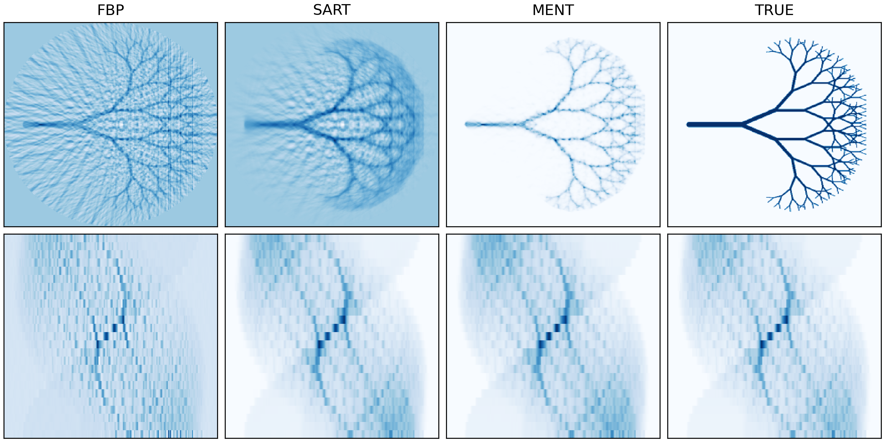

# 2D CT

This example runs conventional 2D CT image reconstruction using MENT, SART, and FBP. MENT shows a clear advantage when the data set is sparse or when the projection angles do not span 180 degrees.
