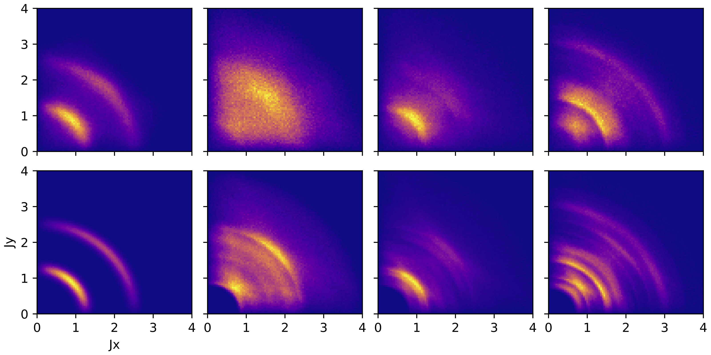

# 4D reconstruction in nonlinear ring

In this example we measure the $x-p_x$ and $y-p_y$ distribution after every 20 turns in a linear periodic lattice + nonlinear rotationally symmetric kick [1]. MENT finds an initial 4D phase space distribution consistent with these projections.

[1] https://arxiv.org/abs/2405.05657
